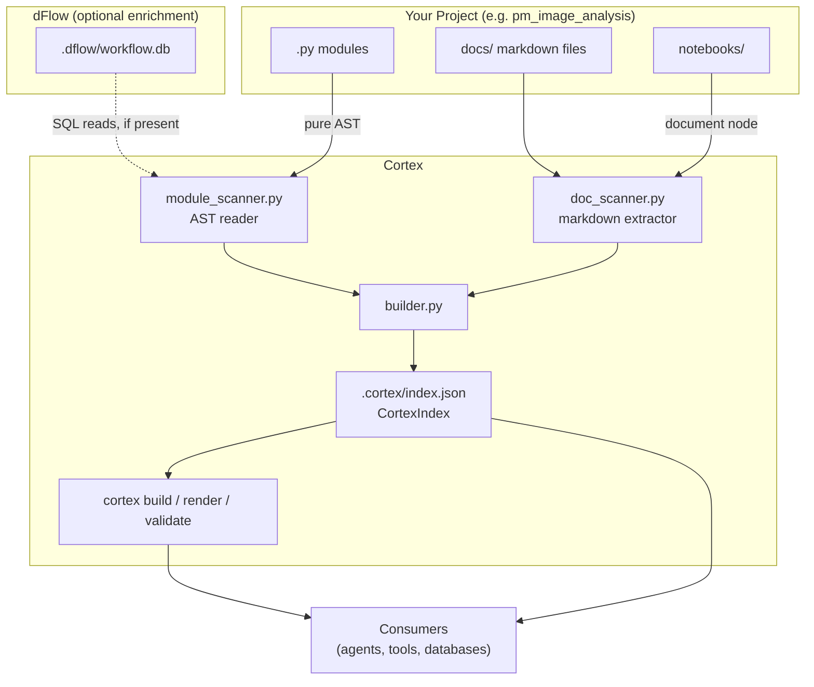
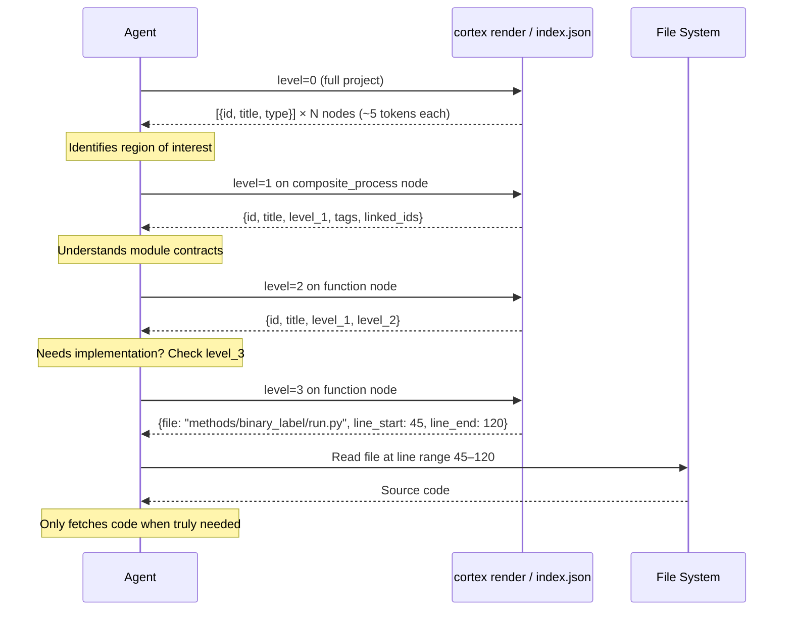
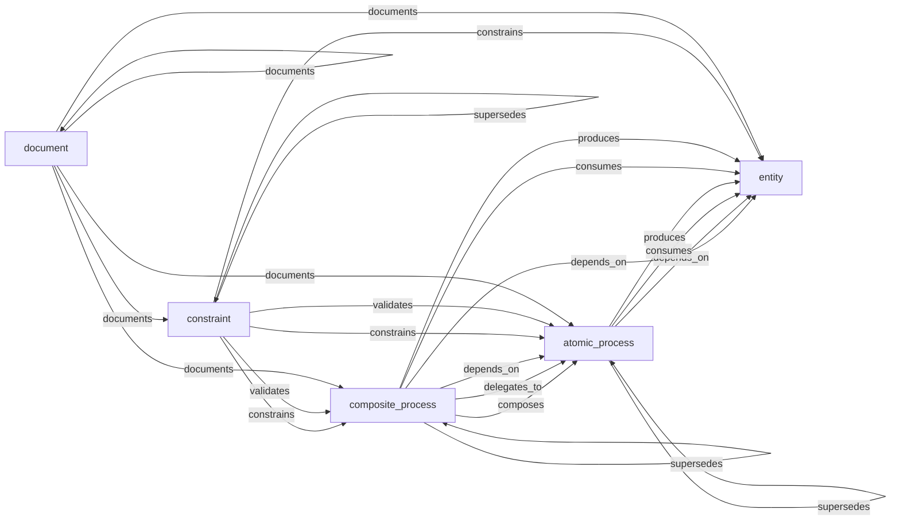
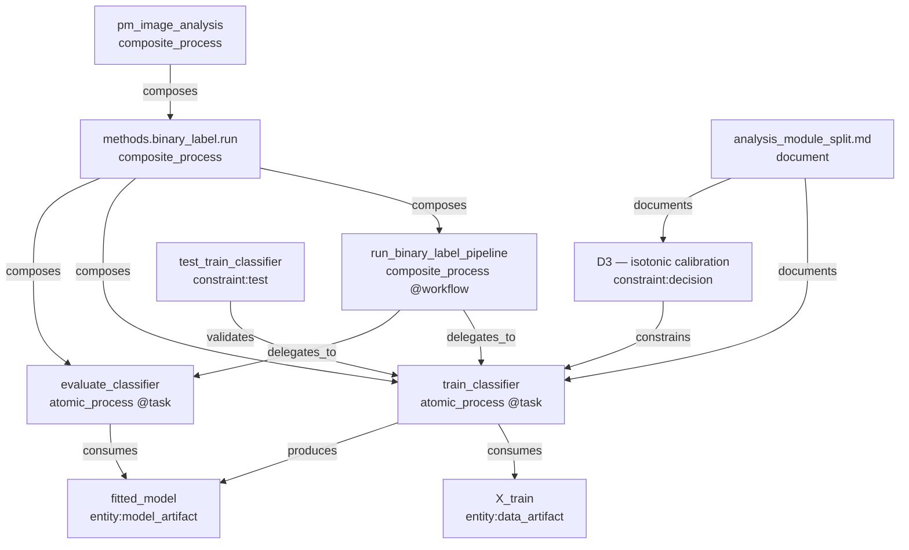

# System Diagrams

All diagrams use Mermaid syntax and can be rendered in GitHub, MkDocs, or any Mermaid-compatible viewer.

---

## 1. System Component Diagram

---

## 2. Resolution Level Flow (Agent Query)

---

## 3. Ontology Edge Type Graph

Valid edge combinations between node types. Only shown edges are permitted by the ontology.

---

## 4. Project Knowledge Graph (Conceptual Example)

A small example of what the graph looks like for a binary classification pipeline.

